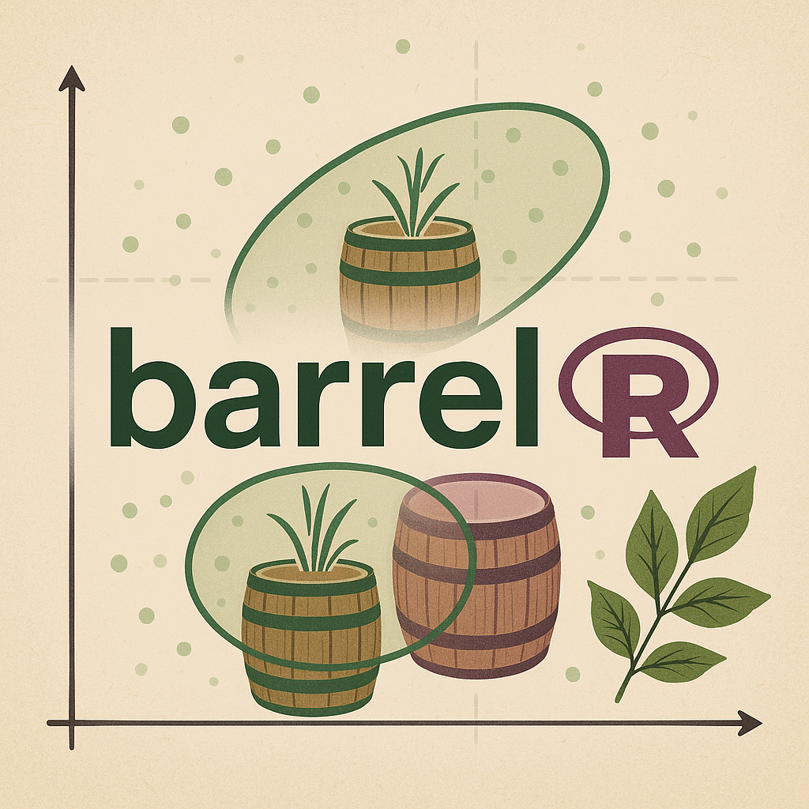
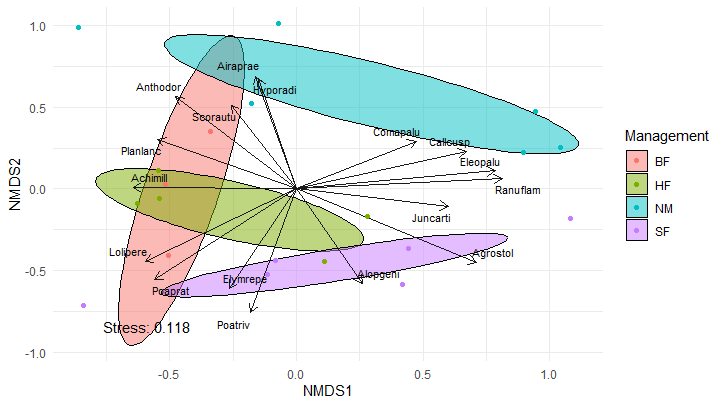

barrel: Ordination visualization in R
================

# barrel 

**A tidy and flexible framework for visualizing multivariate ordinations
in R**

[](https://CRAN.R-project.org/package=barrel)
[](https://github.com/YOUR_USERNAME/barrel/actions)

------------------------------------------------------------------------

## Overview

`barrel` is an R package that enhances the visualization of ordination
analyses (e.g. NMDS, RDA, dbRDA) using `ggplot2`. It provides a modular
set of tools to add ellipses, centroids, environmental vectors, and
annotations — all compatible with tidyverse workflows.

------------------------------------------------------------------------

## Installation

### From CRAN:

``` r
install.packages("barrel")
```

### Development version from GitHub:

``` r
# install.packages("devtools")
devtools::install_github("BarrancoElena/barrel")
```

------------------------------------------------------------------------

## Quick example

``` r
library(vegan)
library(barrel)
library(ggplot2)

data(dune)
data(dune.env)

ord <- metaMDS(dune)
ord <- barrel_prepare(ord, dune.env)

autoplot(ord, group = "Management", data = dune)
```

## \# barrel 

## Key features

- `autoplot()`: single-function plotting of NMDS, RDA, dbRDA, CCA, etc.
- Support for `method = "classic"` and `"robust"` covariance estimation
- Ellipses (`stat_barrel()`), centroids (`stat_barrel_centroid()`),
  vectors (`stat_barrel_arrows()`)
- Annotated variance or stress via `stat_barrel_annotate()`
- Functions to extract group summaries and environmental fits
- Customizable with standard `ggplot2` syntax

------------------------------------------------------------------------

## Vignette

A full user guide is available:

``` r
browseVignettes("barrel")
```

------------------------------------------------------------------------

## Dependencies

- [`vegan`](https://cran.r-project.org/package=vegan)

- [`ggplot2`](https://cran.r-project.org/package=ggplot2)

- [`ggrepel`](https://cran.r-project.org/package=ggrepel)

- [`robustbase`](https://cran.r-project.org/package=robustbase)

- [`stats`](https://cran.r-project.org/package=stats)

- [`grid`](https://cran.r-project.org/package=grid)

- [`rlang`](https://cran.r-project.org/package=rlang)

## Author

**Author details will be provided after peer review**  

------------------------------------------------------------------------

## License

MIT © 2025 Autor name
